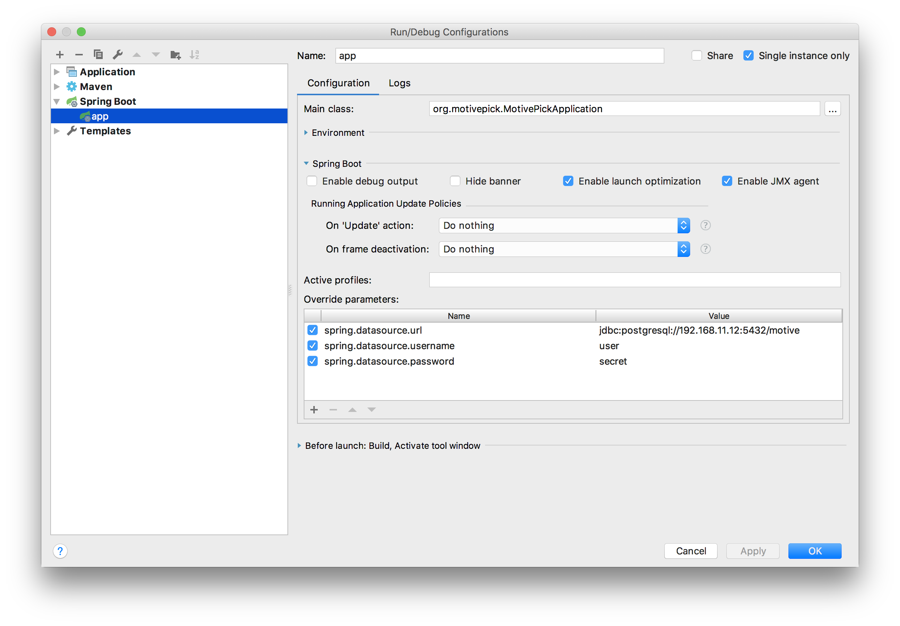

# Motive Back End [](https://travis-ci.com/motivepick/motive-back-end)

The service that is going to defeat the laziness.

Try it out on https://motiv.yaskovdev.com.

## How to run locally

1. Install PostgreSQL
2. Create the database using `CREATE DATABASE motive ENCODING 'UTF8' TEMPLATE template0;`
3. Make sure that the database is running on `localhost` on `5432` port, the username is `postgres` and the password is `postgres`. If that's not the case, see the paragraph below.
3. In the project root run `./mvnw spring-boot:run`.

## How to run with non-default DB

Add the next parameters to your Spring Boot configuration:

```
spring.datasource.url
spring.datasource.username
spring.datasource.password
```

as on the following screenshot:



## How to open Swagger

[http://localhost:8080/swagger-ui.html](http://localhost:8080/swagger-ui.html)

## Short note about deployment to LIVE

When deploy to live make sure at least the next parameters are overridden with LIVE values:

```
spring.datasource.url
spring.datasource.username
spring.datasource.password
motive.facebook.client-secret
```
